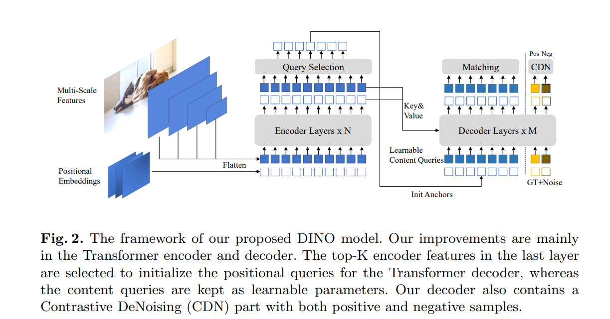
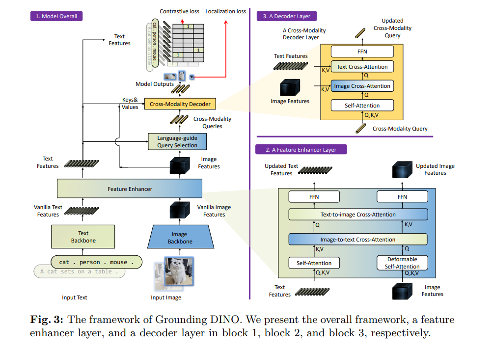
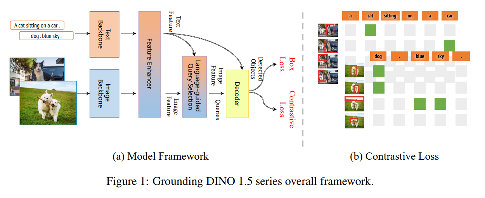
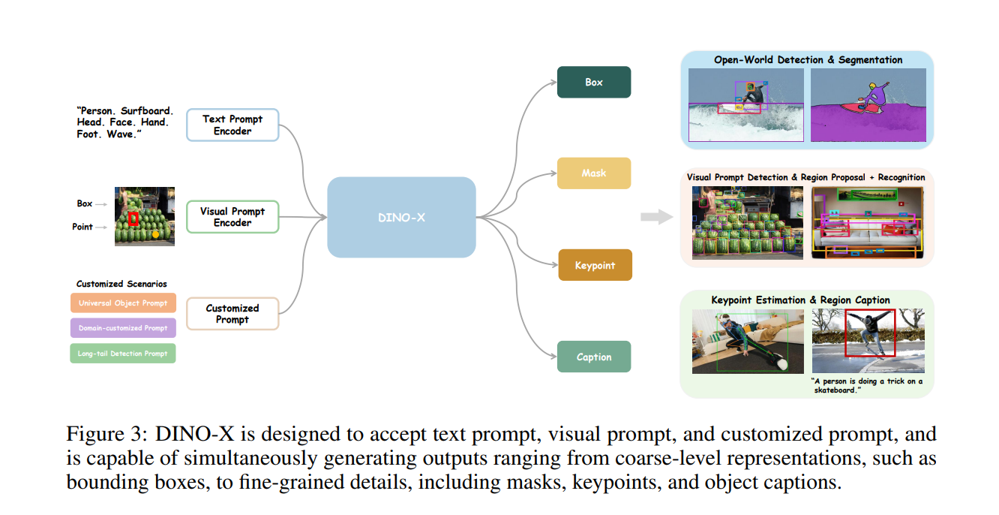
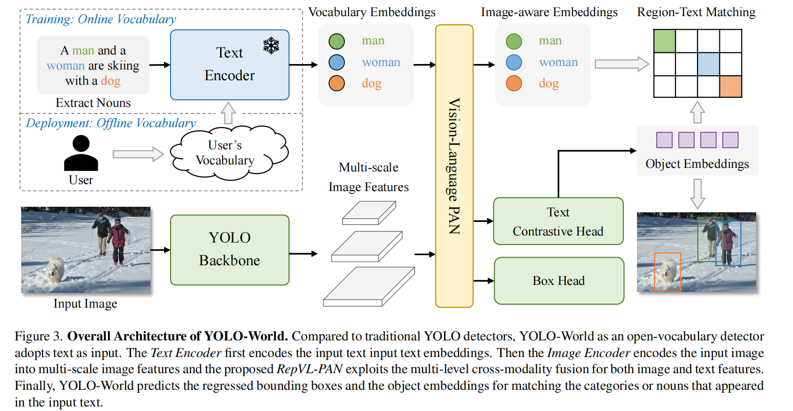
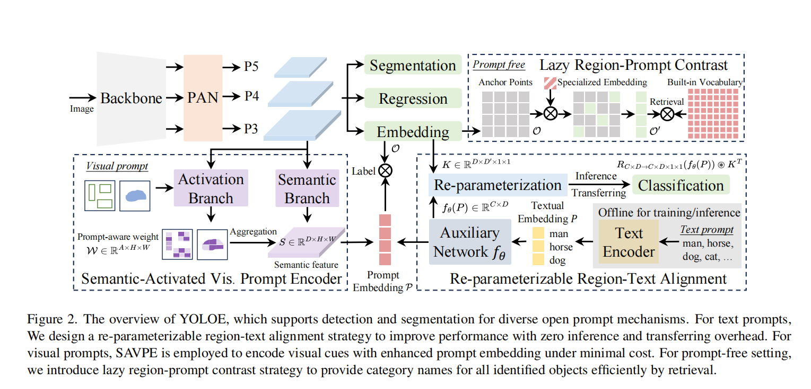

# open_world_object_detection_survey

开放世界目标检测工作汇总。

## 算法

- [DINO: DETR with Improved DeNoising Anchor Boxes for End-to-End Object Detection](https://arxiv.org/abs/2203.03605)
  2022.03 IDEA Research, ICLR
  DINO 是DETR with Improved deNoising anchOr boxes的缩写。 Meta也有系列工作命名为DINO, 但两者没有关系， 要注意区分。
  DINO 的主要贡献是在之前的DETR系列工作上提出了3点改进， 从而提升了模型的性能和效率。 这3点改进是:
    1) 对比去噪训练
    2) anchor初始化的时候采用了混合查询的方法
    3) box预测时的2次前向

DINO做的还是闭集检测， 不算开放世界检测。 但是它是后面几篇工作的基础， 所以放在这里。

- [Grounded SAM: Assembling Open-World Models for Diverse Visual Tasks](https://arxiv.org/abs/2401.14159)  20240.01 IDEA
  Research

- [Grounding DINO: Marrying DINO with Grounded Pre-Training for Open-Set Object Detection](https://arxiv.org/abs/2303.05499)
  2023.03 IDEA Research, ECCV

  Grouding DINO 这篇文章主要是为了做开放世界的目标检测，实现方式是把DINO和短语定位预训练任务结合。作者认为开集检测的核心是引入语言到闭集检测中。为有效融合语言和视觉模态，
  把闭集检测器划分为3个阶段， 并且在3个阶段都进行了融合， 包括特征增强， 语言引导的查询选择 和交叉模态的编码器。这也是区别其他方法的地方，
  其他方法一般在1-2个阶段进行融合。

  

- [Grounding DINO 1.5: Advance the "Edge" of Open-Set Object Detection](https://arxiv.org/abs/2405.10300) 2024.05 IDEA
  Research
  这篇工作主要是在Grounding DINO的基础上进一步扩大了模型规模和数据规模。 有2个版本的模型， 分别是Pro和Edge, Pro主打效果好，
  Edge版本主打高性能， 牺牲了一定的效果。
  相比Grounding DINO, 主要是在密集场景检测， 长尾目标检测和语义理解上有了很大改进， 并且减少了幻觉（检测出图像中没有的prompt对象）。
  

- [DINO-X: A Unified Vision Model for Open-World Object Detection and Understanding](https://arxiv.org/abs/2411.14347)
  2024.11 IDEA Research

  这篇工作在扩展了更多的输入prompt， 包括文本prompt, 视觉prompt和自定义prompt, 从而使得长尾目标检测更容易。
  并且作者构建了包含1亿个高质量样本的数据集。在如此大规模数据上预训练后，
  DINO-X 具备了基础的目标级别的表征能力， 可以支持多种目标感知和理解的任务， 比如检测， 分割， 姿态估计， 问答等等。

上面的DINO和Grounding DINO都是IDEA Research 出的。 Grounding DINO开源， 其他的都没有开源， 而是提供了api的形式使用。
模型体验平台： [https://cloud.deepdataspace.com/](https://cloud.deepdataspace.com/)

- [YOLO-World: Real-Time Open-Vocabulary Object Detection](https://arxiv.org/abs/2401.17270) 2024.02 腾讯 AI Lab, CVPR

  这篇工作把yolo检测器扩展到开放世界的目标检测领域。 相比于其他开放世界检测器， 最大的优点就是轻量化，
  易部署。具体做法是采用yolov8提取图像特征，
  用Clip对文本进行编码，然后把图像特征和文本特征进行融合。

  code: [https://github.com/AILab-CVC/YOLO-World?tab=readme-ov-file](https://github.com/AILab-CVC/YOLO-World?tab=readme-ov-file)

- [YOLOE: Real-Time Seeing Anything](https://arxiv.org/abs/2503.07465) 2025.03 清华

  code:[https://github.com/THU-MIG/yoloe](https://github.com/THU-MIG/yoloe)

## 数据集

| dataset   | Image num | Anno num | category | year | link                                     |
|:----------|:----------|:---------|:---------|:-----|:-----------------------------------------|
| Object365 | 600K      | 10M      | 365      | 2019 | https://www.objects365.org/overview.html |
| GQA       | 113K      | 22M      |          | 2019 | https://arxiv.org/pdf/1902.09506         |
| Flickr    | 31K       | 276K     |          | 2016 | https://arxiv.org/pdf/1505.04870         |
| CC3M      | 3.3M      |          |          | 2018 | https://aclanthology.org/P18-1238.pdf    |
| LVIS      | 164K      | 200M     | 1203     | 2019 | https://arxiv.org/pdf/1908.03195         |
| Ref COCO  | 20K       | 50K      |          | 2016 | https://arxiv.org/pdf/1608.00272v3       |
| Ref COCO+ | 20K       | 49.8K    |          | 2016 | https://arxiv.org/pdf/1608.00272v3       |
| Ref COCOg | 26.7K     | 54.8K    |          | 2016 | https://arxiv.org/pdf/1608.00272v3       |
| COCO      | 164K      | 896K     | 80       | 2014 | https://arxiv.org/abs/1405.0312          |

**注：**

GQA + Flickr 又称为GoldG数据集。
LVIS 使用与COCO数据集完全相同的图像，但有不同的分割和注释。

